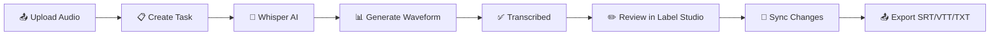

<div align="center">

# 🎙️ Smarti Transcription

### AI-Powered Audio Transcription Platform

[](https://react.dev/)
[](https://nodejs.org/)
[](https://firebase.google.com/)
[](https://openai.com/)
[](https://docker.com/)
[](LICENSE)

**Transform audio into accurate, editable transcriptions with the power of AI**

[Features](#-features) • [Quick Start](#-quick-start) • [Architecture](#-architecture) • [Documentation](#-documentation) • [Contributing](#-contributing)

---


*Modern interface for uploading, transcribing, and reviewing audio files*

</div>

---

## ✨ Features

<table>
<tr>
<td width="50%">

### 🤖 AI Transcription
- **OpenAI Whisper** integration for 95%+ accuracy
- Automatic segment detection with timestamps
- Support for 50+ languages
- Handles various audio qualities

</td>
<td width="50%">

### 📊 Waveform Visualization
- Interactive audio waveform display
- Click-to-seek navigation
- Pre-computed peaks for fast loading
- Professional playback controls

</td>
</tr>
<tr>
<td width="50%">

### ✏️ Professional Review
- **Label Studio** integration for editing
- Pre-loaded AI transcriptions
- Speaker identification support
- Keyboard shortcuts for efficiency

</td>
<td width="50%">

### 📤 Flexible Export
- **SRT** - Video subtitles
- **VTT** - Web captions
- **TXT** - Plain text
- **JSON** - Full data export

</td>
</tr>
<tr>
<td width="50%">

### ⚡ Real-Time Updates
- Live transcription status
- Firestore real-time listeners
- No page refresh needed
- Instant notifications

</td>
<td width="50%">

### 🔄 Batch Processing
- Multi-file upload
- Parallel transcription
- Progress tracking per file
- Auto-scaling with demand

</td>
</tr>
</table>

---

## 🏗️ Architecture

```
┌─────────────────────────────────────────────────────────────────────────┐
│                           Client Browser                                 │
│                        http://localhost:3000                             │
└─────────────────────────────────┬───────────────────────────────────────┘
                                  │
                  ┌───────────────┴───────────────┐
                  │                               │
                  ▼                               ▼
          ┌──────────────┐               ┌───────────────┐
          │  React App   │               │   Firebase    │
          │  (Vite +     │               │  Firestore +  │
          │  Tailwind)   │               │   Storage     │
          └──────┬───────┘               └───────┬───────┘
                 │                               │
                 ▼                               ▼
          ┌──────────────┐               ┌───────────────┐
          │  Express.js  │               │Cloud Function │
          │   Backend    │               │   (Whisper)   │
          │    :5000     │               └───────┬───────┘
          └──────┬───────┘                       │
                 │                               ▼
                 ▼                       ┌───────────────┐
          ┌──────────────┐               │  OpenAI API   │
          │ Label Studio │               │   (Whisper)   │
          │    :8080     │               └───────────────┘
          └──────────────┘
```

### Tech Stack

| Layer | Technologies |
|-------|--------------|
| **Frontend** | React 18, Vite, Tailwind CSS, WaveSurfer.js |
| **Backend** | Node.js, Express, Firebase Admin SDK |
| **Database** | Firebase Firestore (real-time NoSQL) |
| **Storage** | Firebase Cloud Storage |
| **AI/ML** | OpenAI Whisper API |
| **Annotation** | Label Studio (self-hosted) |
| **DevOps** | Docker, Docker Compose |

---

## 🚀 Quick Start

### Prerequisites

- Node.js 18+
- Docker & Docker Compose
- Firebase project
- OpenAI API key

### Installation

```bash
# 1. Clone the repository
git clone https://github.com/ahmadmashhood01/Smarti-Transcription.git
cd Smarti-Transcription

# 2. Install dependencies
cd frontend && npm install && cd ..
cd backend && npm install && cd ..
cd cloud-functions && npm install && cd ..

# 3. Configure environment
cp env.example .env
# Edit .env with your credentials

# 4. Deploy Firebase
firebase login
firebase deploy --only firestore:rules,storage:rules
firebase functions:config:set openai.key="sk-your-key"
firebase deploy --only functions

# 5. Start services
docker-compose up --build
```

### Access Points

| Service | URL | Description |
|---------|-----|-------------|
| 🎨 Frontend | http://localhost:3000 | Main application |
| ⚙️ Backend | http://localhost:5000 | API server |
| 🏷️ Label Studio | http://localhost:8080 | Annotation interface |

---

## 📖 Documentation

| Document | Description |
|----------|-------------|
| [📋 Project Documentation](PROJECT_DOCUMENTATION.md) | Complete system documentation |
| [🏗️ Architecture Guide](ARCHITECTURE.md) | Detailed system architecture |
| [🔧 Setup Guide](SETUP_GUIDE.md) | Step-by-step installation |
| [🚀 Start Servers](START_SERVERS.md) | Running the services |
| [🏷️ Label Studio Setup](LABEL_STUDIO_SETUP.md) | Annotation tool configuration |
| [🔑 Get New Token](GET_NEW_TOKEN.md) | API token generation |
| [❓ Troubleshooting](TROUBLESHOOTING.md) | Common issues & solutions |

---

## 📁 Project Structure

```
Smarti-Transcription/
├── 📁 frontend/                 # React application
│   ├── 📁 src/
│   │   ├── 📁 components/      # UI components
│   │   │   ├── AudioUploader.jsx
│   │   │   ├── TranscriptionList.jsx
│   │   │   ├── WaveformPlayer.jsx
│   │   │   ├── TaskDetails.jsx
│   │   │   └── ExportDialog.jsx
│   │   ├── 📁 services/        # API & Firebase
│   │   ├── App.jsx
│   │   └── main.jsx
│   ├── Dockerfile
│   └── package.json
│
├── 📁 backend/                  # Express API
│   ├── 📁 src/
│   │   ├── 📁 routes/          # API endpoints
│   │   ├── 📁 services/        # Business logic
│   │   └── server.js
│   ├── Dockerfile
│   └── package.json
│
├── 📁 cloud-functions/          # Firebase Functions
│   ├── 📁 transcribe/          # Whisper integration
│   └── index.js
│
├── 📄 docker-compose.yml        # Container orchestration
├── 📄 firebase.json             # Firebase config
├── 📄 firestore.rules           # Database security
└── 📄 storage.rules             # Storage security
```

---

## 🔄 Workflow



### Status Flow

| Status | Description |
|--------|-------------|
| 🟡 `queued` | Task created, waiting for processing |
| 🔵 `transcribing` | Whisper AI processing audio |
| 🟢 `transcribed` | Transcription complete |
| 🟣 `ready_for_review` | Sent to Label Studio |
| ✅ `reviewed` | Human review complete |
| 🔴 `error` | Processing failed |

---


**⭐ Star this repository if you find it helpful!**

Made with ❤️ in Pakistan 🇵🇰

</div>
